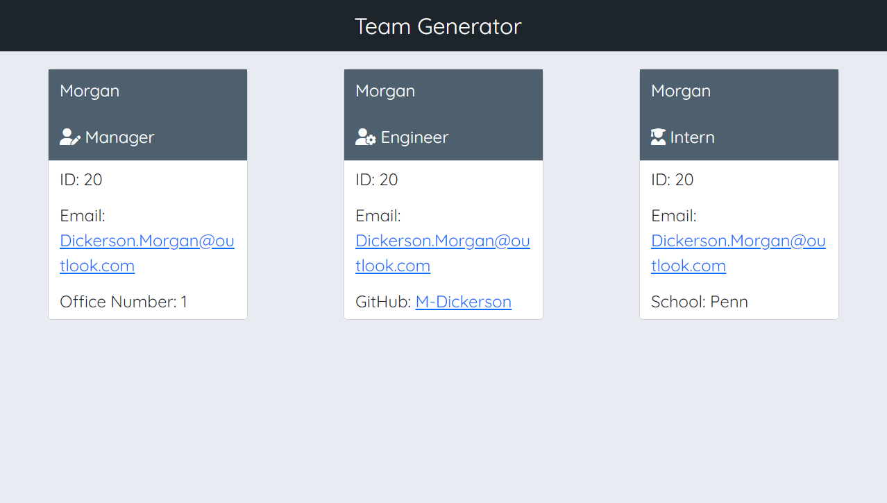

# Team Profile Generator

## Description

The motivation and purpose behind this project was to make a hub to store and organize information on employees. It solves the problem of not having a hub that can be used as a quick reference when searching for information on employees. I learned a lot about implementing and running tests, as well as further using node to generate files.

## Table of Contents

- [Installation](#installation)
- [Usage](#usage)
- [Credits](#credits)
- [License](#license)

## Installation

Inquirer and jest must be installed!

## Usage

[Link to demo video](https://drive.google.com/file/d/1j0Z2YaruFgljq7IkVrM7YYeFLZohXclR/view)

 

## Credits

[Inquirer 8.2.4](https://www.npmjs.com/package/inquirer/v/8.2.4)

[Jest 29.3](https://jestjs.io/)

## License

MIT License

A short and simple permissive license with conditions only requiring preservation of copyright and license notices. Licensed works, modifications, and larger works may be distributed under different terms and without source code.
